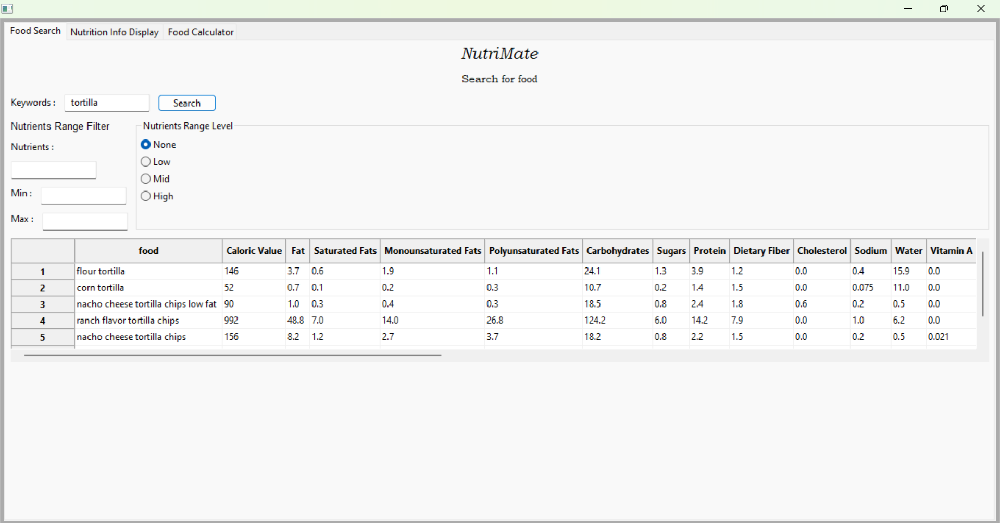
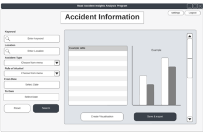
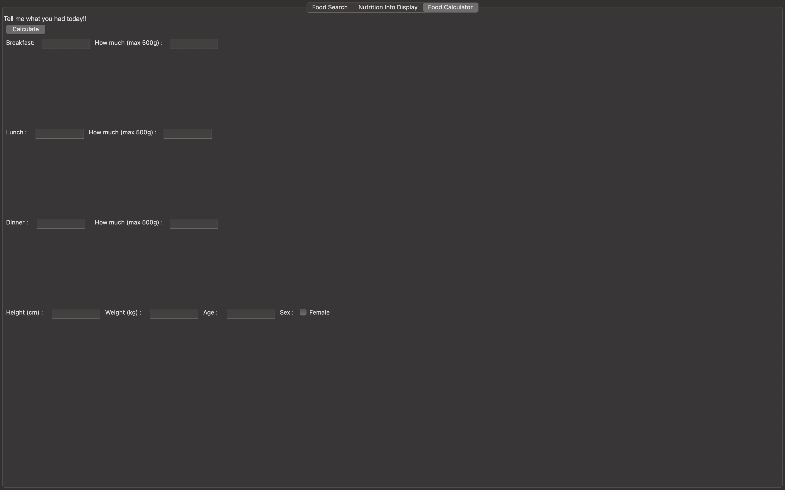

# Executive Summary

Please provide your GitHub repository link.
### GitHub Repository URL: https://github.com/XXXX/XXXXX.git

---

You should use your software to prepare an executive summary as outlined below for the five required features.

## 1. Food Search 
### Description  
This feature filters the database looking for a  keyword. As an example if I look for("tortilla"). It searches the food column for the tortilla and retrieves all the food which has tortilla on it.

### Steps
1. Enter the food that are you looking for in the box next to the keyword.
2. Press Search button.

### Screenshots
Include screenshots for each step demonstrating the use of this feature.  

---

## 2. Food filter by range
### Description  
This feature filters the database looking for food in a nutrient range enter by the consumer. As an example if I look for("tortilla") and nutrient Fat range it between 1 and 3 . It searches the food column for the tortilla and retrieves all the food which meet the criteria.

### Steps
1. Enter the food that are you like for in the box next to the keyword.
2. Enter a nutrient in the box below nutrients.
3. Enter the max and min their respective boxes.
4. Press button Search.

### Screenshots
Include screenshots for each step demonstrating the use of this feature.  

---

## 3. Food filter by level
### Description  
This feature filters the database looking for food in a nutrient level enter by the consumer. As an example if I look for("tortilla") and for nutrient enter Fat High. It searches the food column for th e tortilla and retrieves all the food which meets criteria.

### Steps
1. Step-by-step instructions for using this feature.
2. Add additional steps as needed.

### Screenshots
Include screenshots for each step demonstrating the use of this feature.    

---

## 4. [Feature 4 Name]
### Description  
Briefly describe what this feature does.

### Steps
1. Step-by-step instructions for using this feature.
2. Add additional steps as needed.

### Screenshots
Include screenshots for each step demonstrating the use of this feature.    

---

## 5. [Feature 5 Name]
### Description  
This function calculates the user's nutrition and calorie intake, as well as their BMI, based on the provided input. It also generates two visualizations:

Bar Chart: Displays how well the user has balanced their intake of the five main macronutrients (carbohydrates, fats, proteins, fiber, and sugars). This helps the user understand whether they are consuming these nutrients in a balanced way.

Pie Chart: Based on the user’s health data, this chart shows how well the user has managed their calorie intake. It visually represents how the user's caloric intake aligns with recommended levels, giving insights into overall dietary balance.

### Steps
1. **Input Meals:** Enter what you had for breakfast, lunch, and dinner along with the quantities for each meal.
2. **Input Personal Data:** Provide your height, weight, age, and gender for BMI calculation.
3. **Calculate:** Click the "Calculate" button to process the nutritional and health data.
4. **Review Nutrition Summary:** After the calculations, a "Nutrition Summary" pop-up will appear. Click "OK" to proceed.

### Screenshots
Include screenshots for each step demonstrating the use of this feature.    

---
