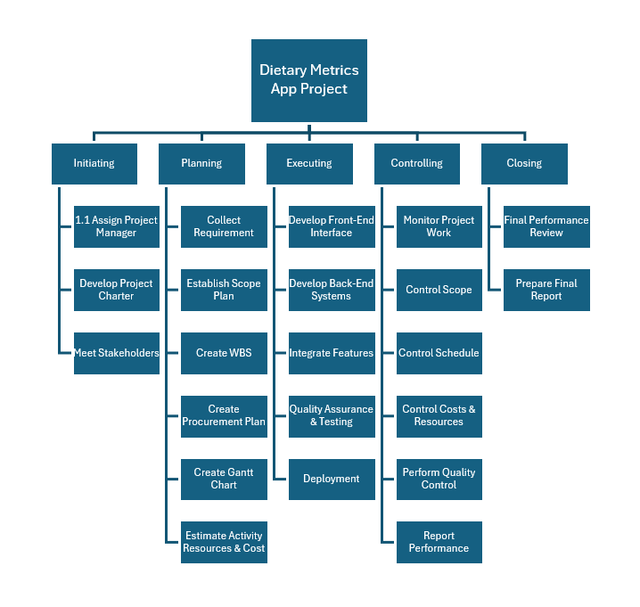
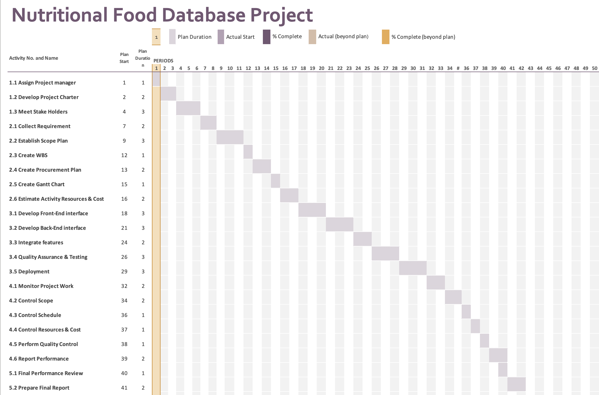

# Project Plan

## Project Name: XXXX
## Group Number: 001

### Team members

| Student No. | Full Name          | GitHub Username | Contribution (sum to 100%) | 
|-------------|--------------------|-----------------|----------------------------|
| s5302345    | Hartono Susanto    | hartonoosu      | 33.3% or Equal             |
| s5270370    | Lindsay Soldevilla | LindsayM23      | 33.3% or Equal             | 
| s5327772    | Hao Tsuneyama      | hao80206        | 33.3% or Equal             | 

### Brief Description of Contribution

Please Describe what you have accomplished in this group project.
- s5302345, Hartono Susanto
  - Accomplishments: Created a repository for this project.
- s222222, Full name
  - Accomplishments: Describe what you have completed or achieved
- s5327772, Hao Tsuneyama
  - Accomplishments: Describe what you have completed or achieved

# Table of Contents

* [Project Plan](#project-plan)
  * [1. Project Overview](#1-project-overview)
    * [1.1 Project Objectives](#11-project-objectives)
    * [1.2 Project Stakeholders](#12-project-stakeholders)
    * [1.3 Project Scope](#13-project-scope)
  * [2. Work Breakdown Structure](#2-work-breakdown-structure)
  * [3. Activity Definition Estimation](#3-activity-definition-estimation)
  * [4. Gantt Chart](#4-gantt-chart)

## 1. Project Overview

### 1.1 Company Introduction

Better Life is a company focused on helping people lead healthier lives by providing tools and resources that support informed dietary choices and overall well-being.

### 1.2 Project Objectives

The goal of this project is to create a user-friendly app for Better Life's Nutritional Food Database, called NutriMate. This NutriMate app will make it easier for users to find and understand detailed nutritional information. It will include advanced search tools that let users filter and analyze data by food type, nutrient content, and nutritional density, helping them make informed dietary choices.

NutriMate will also be featuring visual aids like pie charts and bar graphs to show the nutritional breakdown of foods clearly. These visuals will help users grasp the information more easily, leading to better dietary decisions. The tool will also be useful for dietitians, researchers, and educators, helping with dietary planning and nutritional education.

Additionally, the project will implement a Daily Nutrition Calculator. This tool will enable users to input the foods they have consumed throughout the day and calculate their total nutritional intake.

### 1.2 Project Stakeholders

**Internal Stakeholders:**
* Company Executives oversee the project to ensure it aligns with the company’s goals. They focus on how the project can improve the company’s performance and reputation.

* Product Manager: Leads the project, bridging the gap between the technical team and the business objectives. They ensure the tool meets user needs, stays on schedule, and fulfills the company’s strategic goals

* Programmers and Designers work on building the software. They combine technical expertise with creative design (UI/UX )to ensure the tool is both effective and appealing.

* Marketing Team works to get the tool noticed. They create campaigns that explain the benefits of the tool to attract and keep users.

* Quality Assurance Team tests the software thoroughly to make sure this tool works perfectly and meets all user needs before it goes live.

**Potential End-Users:**

* The General Public includes anyone interested in learning more about their food choices. The tool provides them with clear nutritional information, helping them make healthier decisions.
* Dietitians, Nutritionists, and Healthcare Professionals use the tool to get accurate nutritional information, which helps them give better advice to their clients and patients.
* Researchers and Educators use the tool to enrich their academic and educational projects. It provides them with a reliable source of nutritional data that enhances learning and research activities.

### 1.3 Project Scope

### Project Scope

**In-Scope (Included in the Project):**

- **User Interface Design:**

  Creating a user-friendly desktop graphical interface (GUI) for easily navigating and interacting with the nutritional database.

- **Core Functionalities:**
  * Food Search: Implementation of a feature that enables users to search for foods by name and view all relevant nutritional information.
  * Nutrition Breakdown: Creation of visual tools, such as pie charts and bar graphs, to display the breakdown of various nutrients for one selected food item.
  * Nutrition Range Filter: Introducing a filtering option that lets users set minimum and maximum values for specific nutrients, then finding foods within those ranges.
  * Nutrition Level Filter: Implementation of a categorization and filtering system that organizes foods by nutritional content levels—low, mid, and high—based on predefined thresholds.
  * Daily Nutrition Calculator: Development of a feature that enables users to input their daily food intake, calculate total nutritional consumption, with visual aids to illustrate nutrient contributions.

- **Data Integration:**

  Integrating the provided nutritional database with the application to ensure users can access and analyze the data effectively.

- **Visual Aids:**

  Implementing graphical elements such as pie charts and bar graphs to help users visualize the nutritional data clearly.

- **Testing and Quality Assurance:**

  * Performing thorough testing of the software to ensure all features work as expected and meet user requirements. 
  * Conducting usability testing to ensure the interface is easy to use and intuitive.

- **Documentation and Version Control:**
  * Providing comprehensive documentation of the design, development process, and user instructions.
  * Using a private GitHub repository for tracking progress with regular commits.

**Out-of-Scope (Excluded from the Project):**

- **Mobile and Web Application Development:**
  
  The project will not involve creating a mobile version or web-based interface of the application. The focus will be on desktop software.

- **Database Expansion:**
 
  The project will not include the creation or modification of the nutritional database. It will use the provided dataset as-is.

- **Third-Party Integrations:**
  
  Integrating with third-party services or external databases is not part of this project.

- **Advanced Data Analytics:**
  
  The project will not include complex data analytics beyond the basic filtering, searching, and visualization features outlined in the scope.

- **Advanced Machine Learning Algorithms:**

  Implementing complex machine learning models is not within the scope of this project.

## 2. Work Breakdown Structure

The Work Breakdown Structure (WBS) for the NutriMate App Project details the key tasks and deliverables needed to develop the app. It breaks down the project into manageable phases, including initiating, planning, executing, controlling and closing.

## 3. Activity Definition Estimation

| Activity #No | Activity Name                       | Brief Description                                                                                                      | Duration | Responsible Team Members |
|--------------|-------------------------------------|------------------------------------------------------------------------------------------------------------------------|----------|--------------------------|
| 1.1          | Assign Project Manager              | Appoint a qualified individual to over see the project's execution and ensure its success                              | 1 day    | Hartono                  |
| 1.2          | Develop Project Charter             | Create a formal document outlining the project objectives, scope, stakeholders, and authority                          | 2 days   | All                      |
| 1.3          | Meet Stake Holders                  | Organize initial meetings with stakeholders to gather input and set expectations                                       | 3 days   | All                      |
| 2.1          | Collect Requirement                 | Gather and document detailed requirements from stakeholders for the project deliverables.                              | 2 days   | All                      |
| 2.2          | Establish Scope Plan                | Define and document the project scope, including objectives, deliverables, and constraints.                            | 3 days   | Hao                      |
| 2.3          | Create WBS                          | Develop a Work Breakdown Structure (WBS) to break down the project into manageable tasks.                              | 1 day    | Hartono                  |
| 2.4          | Create Procurement Plan             | Develop a plan for acquiring goods and services from external suppliers                                                | 2 days   | Lindsay                  |
| 2.5          | Create Gantt Chart                  | Develop a Gantt Chart to visually represent the project schedule and timeline                                          | 1 day    | Hao                      |
| 2.6          | Estimate Activity Resources & Cost  | Assess the resources and budget needed for each activity to ensure effective allocation and cost management            | 2 days   | Lindsay                  |
| 3.1          | Develop Front-End interface         | Design and build the user-interface, focusing on usability and accessibility for diverse end-users                     | 3 days   | Hartono                  |
| 3.2          | Develop Back-End interface          | Create the server-side logic, databases, and APIs to support the front-end interface and overall functionality         | 3 days   | Lindsay                  |
| 3.3          | Integrate features                  | Combine Front-End and Back-End components to ensure seamless, cohesive user experience                                 | 2 days   | Hartono & Lindsay        |
| 3.4          | Quality Assurance & Testing         | Perform through testing to validate that the tool meets all specifications amd quality standards                       | 3 days   | Hao                      |
| 3.5          | Deployment                          | Deploy the completed tool the production environment for use by all stakeholders and end-users                         | 3 days   | All                      |
| 4.1          | Monitor Project Work                | Continuously track and assess project activities to ensure alignment with the project plan and scope                   | 2 days   | All                      |
| 4.2          | Control Scope                       | Manage changes to the project scope to avoid scope creep and maintain focus on key objectives                          | 2 days   | Lindsay                  |
| 4.3          | Control Schedule                    | Oversee the project timeline to ensure all tasks are completed within the designated timeframe                         | 1 day    | Hao                      |
| 4.4          | Control Resources & Cost            | Monitor and adjust resource usage and expenses to keep the project within budget                                       | 1 day    | Lindsay                  |
| 4.5          | Perform Quality Control             | Conduct reviews and inspections to ensure that project deliverables meet defined quality criteria                      | 1 days   | Hartono                  |
| 4.6          | Report Performance                  | Create and distribute regular performance reports to stakeholders to provide updates on progress and issues            | 2 days   | Hartono                  |
| 5.1          | Final Performance Review            | Conduct a comprehensive review of project performance, documenting successes and areas for improvement                 | 1 day    | Hao                      |
| 5.2          | Prepare Final Report                | Compile a detailed final report summarizing project outcomes, lessons learned, and recommendations for future projects | 2 days   | Hao                      |

## 4. Gantt Chart
You have to use the provided Gantt chart template.  

Use the provided Gantt chart template to list all items from the Activity Definition along with relevant estimates 
and scheduling. Ensure that the Gantt chart reflects the activity definitions from Section 3. Track actual start 
times and durations. Besides including Gantt chart here, you should also submit your Gantt chart file separately.

