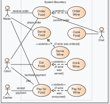

# Software Design Document

## Project Name: XXXX
## Group Number: 001

## Team members

| Student Number | Name      | 
|----------------|-----------|
| s111111        | Full name |
| s222222        | Full name | 
| s333333        | Full name | 

# Table of Contents

<!-- TOC -->
* [Table of Contents](#table-of-contents)
  * [1. System Vision](#1-system-vision)
    * [1.1 Problem Background](#11-problem-background)
    * [1.2 System capabilities/overview](#12-system-capabilitiesoverview)
    * [1.3	Potential Benefits](#13potential-benefits)
  * [2. Requirements](#2-requirements)
    * [2.1 User Requirements](#21-user-requirements)
    * [2.2	Software Requirements](#22software-requirements)
    * [2.3 Use Case Diagrams](#23-use-case-diagrams)
    * [2.4 Use Cases](#24-use-cases)
  * [3.	Software Design and System Components](#3-software-design-and-system-components-)
    * [3.1	Software Design](#31software-design)
    * [3.2	System Components](#32system-components)
      * [3.2.1 Functions](#321-functions)
      * [3.2.2 Data Structures / Data Sources](#322-data-structures--data-sources)
      * [3.2.3 Detailed Design](#323-detailed-design)
  * [4. User Interface Design](#4-user-interface-design)
    * [4.1 Structural Design](#41-structural-design)
    * [4.2	Visual Design](#42visual-design)
<!-- TOC -->

## 1. System Vision

### 1.1 Problem Background

- Problem Identification: What problem does this system solve?
- Dataset: What is the dataset used?
- Data Input/Output: What kind of data input and output is required?
- Target Users: Who will use the system, and why?

### 1.2 System capabilities/overview

- System Functionality: What will the system do?
- Features and Functionalities: Describe the key features and functionalities of the system.

### 1.3	Benefit Analysis

How will this system provide value or benefit?

## 2. Requirements

### 2.1 User Requirements

Detail how users are expected to interact with or use the program. What functionalities must the system provide from the end-user perspective? This can include both narrative descriptions and a listing of user needs.

Note: Since no specific client or user is assigned, you may create a fictional user. Who do you envision using your software?

### 2.2	Software Requirements
Define the functionality the software will provide. This section should list requirements formally, often using the word "shall" to describe functionalities.

Example Functional Requirements:  
- R1.1 The program shall accept multiple file names as arguments from the command line.  
- R1.2 Each file name can be a simple file name or include the full path of the file with one or more levels.  

- etc …

### 2.3 Use Case Diagram
Provide a system-level Use Case Diagram illustrating all required features.

Example:  

### 2.4 Use Cases
Include at least 5 use cases, each corresponding to a specific function.

| Use Case ID    | xxx  |
|----------------|------|
| Use Case Name  | xxxx |
| Actors         | xxxx |
| Description    | xxxx |
| Flow of Events | xxxx |
| Alternate Flow | xxxx |

## 3.	Software Design and System Components 

### 3.1	Software Design
Include a flowchart that illustrates how your software will operate.

Example:  

### 3.2	System Components

#### 3.2.1 Functions
This section lists the main functions used in the NutriApp software. Each function’s purpose is explained, along with the inputs it takes, what it returns, and any side effects. These functions are key to making the app work, like searching for foods, filtering nutrition data, calculating users' calorie and nutrient intake and needs, and showing nutrient breakdowns visually.

##### 3.2.1.1 find_food(name)
- **Description:** Looks up the food database for an item by name and returns matching results.
- **Input Parameters:**
  - name (str): The food name to search for.
  - food_data_list (list): A list of dictionaries that hold food items and their nutritional details.
- **Return Value:** Returns a list of dictionaries with the food items that match the name.
- **Side Effects:** None. This function doesn’t change any global variables or the data it’s given.

##### 3.2.1.2 get_nutrition(name)
- **Description:** Gets the nutritional details for a specific food item.
- **Input Parameters:**
  - name (str): The name of the food item to get details for.
  - food_data_list (list): A list of dictionaries that hold food items and their nutritional details.
- **Return Value:** Returns a dictionary with the nutrition details for the selected food item.
- **Side Effects:** None. This function doesn’t change any global variables or the data it’s given.

##### 3.2.1.3 filter_by_range(nutrient, min_val, max_val)
- **Description:** Filters the food database to find items within a specific range of a nutrient.
- **Input Parameters:**
  - nutrient (str): The nutrient to filter by (e.g., 'calories', 'protein').
  - min_val (float): The minimum value for the nutrient range.
  - max_val (float): The maximum value for the nutrient range.
  - food_data_list (list): A list of dictionaries that hold food items and their nutritional details.
- **Return Value:** Returns a list of dictionaries with food items that fit within the given nutrient range.
- **Side Effects:** None. This function doesn’t change any global variables or the data it’s given.

##### 3.2.1.4 filter_by_level(level)
- **Description:** Filters food items based on their nutrient levels (low, mid, high).
- **Input Parameters:**
  - level (str): The nutrient level to filter by (e.g., 'low', 'mid', 'high').
  - nutrient_levels (dict): A dictionary with nutrient levels for various foods.
  - food_data_list (list): A list of dictionaries that hold food items and their nutritional details.
- **Return Value:** Returns a list of dictionaries with food items that match the chosen nutrient level.
- **Side Effects:** None. This function doesn’t change any global variables or the data it’s given.

##### 3.2.1.5 calc_calories(user_data)
- **Description:** Calculates the daily calorie needs for a user based on their personal info.
- **Input Parameters:**
  - user_data (dict): A dictionary with user info like weight, height, age, and activity level.
- **Return Value:** Returns a float value that represents the user’s daily calorie requirement.
- **Side Effects:** None. This function only uses the input data and doesn’t affect anything else.

##### 3.2.1.6 calc_nutrients(user_data)
- **Description:** Calculates the daily recommended nutrient intake for a user.
- **Input Parameters:**
  - user_data (dict): A dictionary with user info like weight, height, age, and dietary goals.
- **Return Value:** Returns a dictionary with the recommended daily intake of nutrients (e.g., protein, fat, carbs).
- **Side Effects:** None. This function only uses the input data and doesn’t affect anything else.

##### 3.2.1.7 load_food_csv(source)
- **Description:** Loads food data from a CSV file into the app’s internal data structures.
- **Input Parameters:**
  - source (str): The file path or location of the CSV file with food and nutrient data.
- **Return Value:** Returns a list of dictionaries where each represents a food item with its nutritional details.
- **Side Effects:** This function fills the internal food data list with info from the CSV file.

##### 3.2.1.8 load_nutrient_csv(source)
- **Description:** Loads nutrient descriptions from a CSV file into the app.
- **Input Parameters:**
  - source (str): The file path or location of the CSV file with nutrient descriptions.
- **Return Value:** Returns a dictionary where each key is a nutrient name and the value is its description.
- **Side Effects:** This function fills the internal nutrient description data with info from the CSV file.

##### 3.2.1.9 update_food_csv(new_data)
- **Description:** Updates the current food data with new or changed food items.
- **Input Parameters:**
  - new_data (list): A list of dictionaries where each one represents a new or updated food item.
- **Return Value:** Returns an updated list of food items that includes the new data.
- **Side Effects:** This function updates the internal food data list by adding or modifying items.

##### 3.2.1.10 update_nutrient_csv(new_data)
- **Description:** Updates the current nutrient descriptions with new or changed info.
- **Input Parameters:**
  - new_data (dict): A dictionary where each key is a nutrient and the value is the updated description.
- **Return Value:** Returns an updated dictionary of nutrient descriptions.
- **Side Effects:** This function updates the internal nutrient description data with the new info.

##### 3.2.1.11 prep_visual_data(food_item)
- **Description:** Prepares the nutritional info of a selected food item for visualization.
- **Input Parameters:**
  - food_item (dict): A dictionary that represents the food item with its nutritional details.
- **Return Value:** Returns a dictionary or array set up for use in visualizations like charts.
- **Side Effects:** None. This function only prepares data for visualization and doesn’t change anything else.

##### 3.2.1.12 make_pie(data)
- **Description:** Creates a pie chart from the provided nutritional data.
- **Input Parameters:**
  - data (dict or array): The structured data ready for visualization, representing nutrient distribution.
- **Return Value:** Returns a pie chart or directly displays the chart.
- **Side Effects:** None. This function only visualizes the data without changing other parts of the app.

##### 3.2.1.13 make_bar(data)
- **Description:** Creates a bar chart to show the nutrient breakdown of a food item.
- **Input Parameters:**
  - data (dict or array): The structured data ready for visualization, representing nutrient amounts.
- **Return Value:** Returns a bar chart or directly displays the chart.
- **Side Effects:** None. This function only visualizes the data without changing other parts of the app.

#### 3.2.2 Data Structures / Data Sources
This section explains the data structures and external sources used in NutriApp. It covers what each data structure is, how it’s used in the app, and which functions work with it. These data structures are important for handling and processing the nutrition info, user data, and visual outputs that the app relies on.

##### 3.2.2.1 Food Data List
- Type: List of dictionaries
- Usage:
  - Stores food items, each with details like calories, protein, and fat in a dictionary format.
  - Used in the Food Search feature to find foods by name and show their nutritional info.
- Functions:
  - find_food(name): Finds and returns foods that match the name given.
  - get_nutrition(name): Gets the nutrition details for the selected food.
  - filter_by_range(nutrient, min_val, max_val): Filters foods based on a range of nutrient values.
  - filter_by_level(level): Filters foods by their nutrient levels like low, mid, or high.

##### 3.2.2.2 Nutrient Range Filter
- Type: Dictionary
- Usage:
  - Keeps the min and max values for each nutrient that the user sets.
  - Used in the Nutrition Range Filter feature to filter foods by these nutrient values.
- Functions:
  - set_range(nutrient, min_val, max_val): Sets the range for a nutrient.
  - apply_range_filter(): Filters the foods using the current range settings.

##### 3.2.2.3 User Input Data
- Type: Dictionary
- Usage:
  - Stores user data, like weight and activity level, for doing different calculations.
  - Used in the Calculator feature to give personalized nutrition info.
- Functions:
  - calc_calories(user_data): Calculates how many calories the user needs daily.
  - calc_nutrients(user_data): Calculates how much of each nutrient the user needs.

##### 3.2.2.4 Food Nutrition Levels
- Type: Set
- Usage:
  - Stores preset levels (low, mid, high) for nutrients based on percentage ranges.
  - Used in the Nutrition Level Filter feature to group foods by their nutrient levels.
- Functions:
  - get_level(food_item, nutrient): Figures out if a food's nutrient level is low, mid, or high.
  - filter_by_level(level): Lists foods that match the chosen nutrient level.

##### 3.2.2.5 Food Database
- Type: External Data Source (CSV files)

  The main source of data for the app, consisting of two CSV files. One file contains food names and their nutrients. The other file provides descriptions for each nutrient.

- Usage:
  - Used to fill the Food Data List with food items and their nutritional values and to add descriptions for each nutrient.
- Functions:
  - load_food_csv(source): Loads food and nutrient data from the CSV file into the app.
  - load_nutrient_csv(source): Loads nutrient descriptions from the CSV file.
  - update_food_csv(new_data): Updates the existing food data with new or changed items.
  - update_nutrient_csv(new_data): Updates the nutrient descriptions with new or changed details.

##### 3.2.2.6 Visualization Data
- **Type:** List of dictionaries
- **Usage:**
  - Holds data that’s ready to be shown visually (e.g., bar charts, pie charts).
  - Used in the Nutrition Breakdown feature to show nutrient distributions visually.
- **Functions:**
  - `prep_visual_data(food_item)`: Prepares the nutrition info of a food item for visualization.
  - `make_pie(data)`: Creates a pie chart from the data.
  - `make_bar(data)`: Creates a bar chart to show the nutrient breakdown.

#### 3.2.3 Detailed Design
Provide pseudocode or flowcharts for all functions listed in Section 3.2.1 that operate on data structures. For instance, include pseudocode or a flowchart for a custom searching function.

## 4. User Interface Design

### 4.1 Structural Design
Present a structural design, a hierarchy chart, showing the overall interface’s structure. Address:

- Structure: How will the software be structured?
- Information Grouping: How will information be organized?
- Navigation: How will users navigate through the software?
- Design Choices: Explain why these design choices were made.

Example:  

### 4.2	Visual Design
Include all wireframes or mock-ups of the interface. Provide a discussion, explanation, and justification for your design choices. Hand-drawn wireframes are acceptable.

- Interface Components: Clearly label all components.
- Screens/Menus: Provide wireframes for different screens, menus, and options.
- Design Details: Focus on the layout and size of components; color and graphics are not required. 

Example:  

