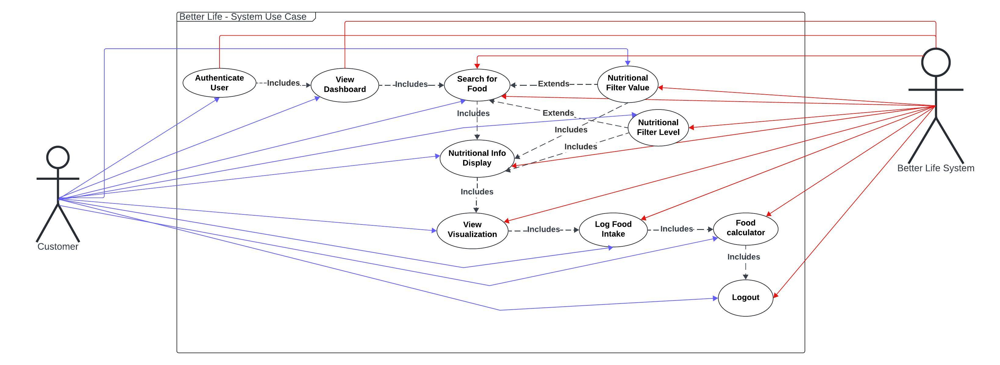
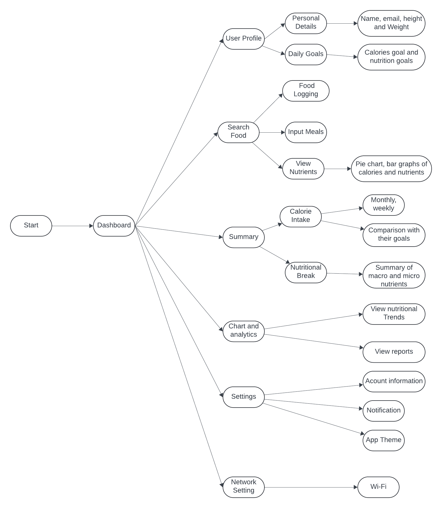
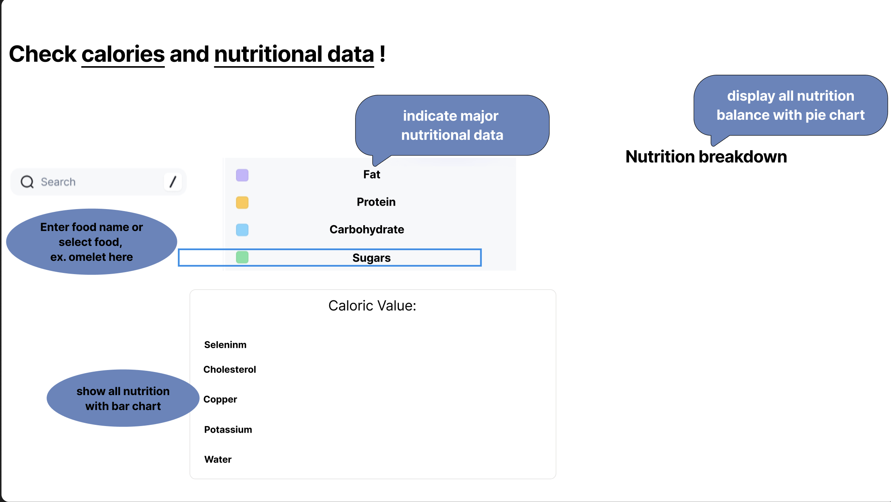
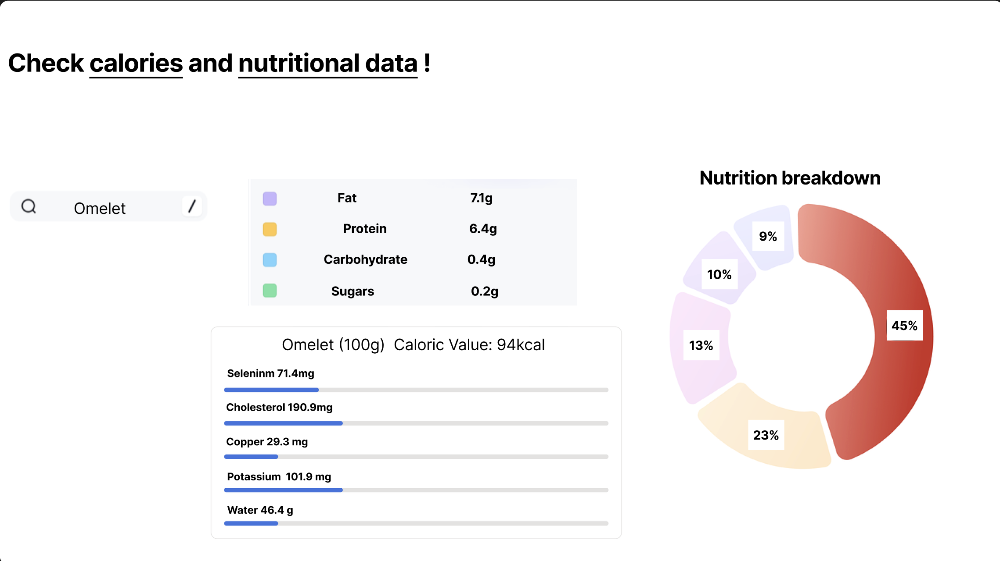
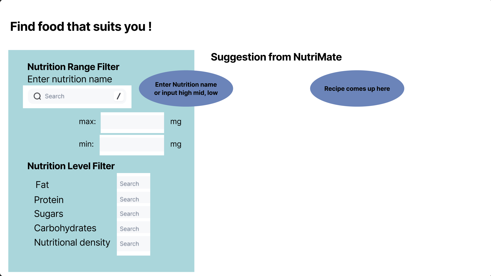
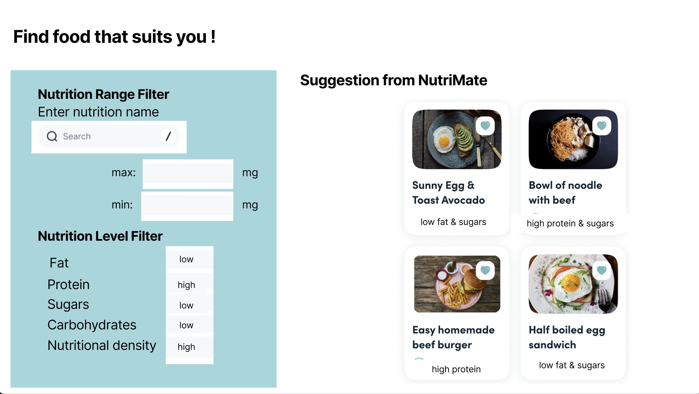
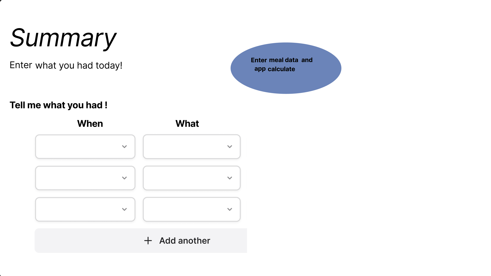
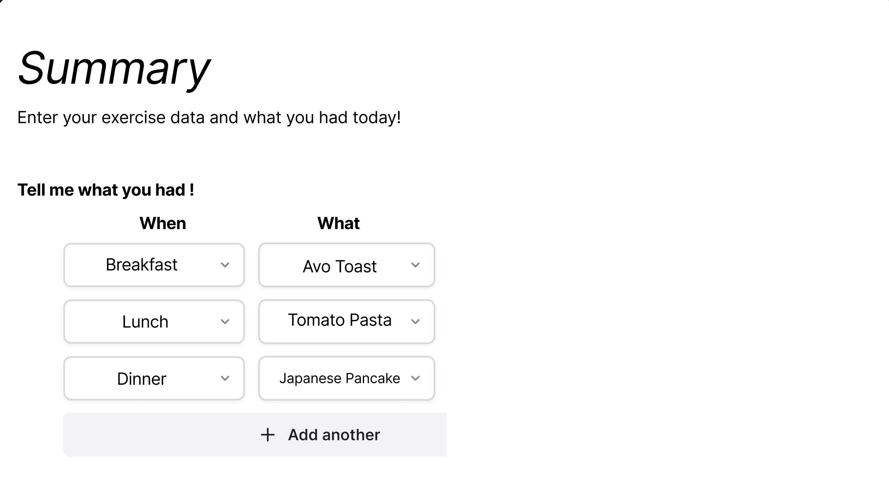
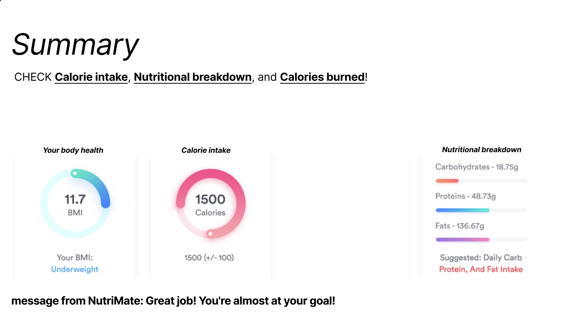

# Software Design Document

## Project Name: XXXX
## Group Number: 001

## Team members

| Student Number | Name      | 
|----------------|-----------|
| s111111        | Full name |
| s222222        | Full name | 
| s333333        | Full name | 

# Table of Contents

<!-- TOC -->
* [Table of Contents](#table-of-contents)
  * [1. System Vision](#1-system-vision)
    * [1.1 Problem Background](#11-problem-background)
    * [1.2 System capabilities/overview](#12-system-capabilitiesoverview)
    * [1.3	Potential Benefits](#13potential-benefits)
  * [2. Requirements](#2-requirements)
    * [2.1 User Requirements](#21-user-requirements)
    * [2.2	Software Requirements](#22software-requirements)
    * [2.3 Use Case Diagrams](#23-use-case-diagrams)
    * [2.4 Use Cases](#24-use-cases)
  * [3.	Software Design and System Components](#3-software-design-and-system-components-)
    * [3.1	Software Design](#31software-design)
    * [3.2	System Components](#32system-components)
      * [3.2.1 Functions](#321-functions)
      * [3.2.2 Data Structures / Data Sources](#322-data-structures--data-sources)
      * [3.2.3 Detailed Design](#323-detailed-design)
  * [4. User Interface Design](#4-user-interface-design)
    * [4.1 Structural Design](#41-structural-design)
    * [4.2	Visual Design](#42visual-design)
<!-- TOC -->

## 1. System Vision

### 1.1 Problem Background

- The nutritional base of Better Life is overly simplistic and challenging for customers to navigate, leading many to abandon it in favor of other tools. This base database is intended  to provide users with nutritional information about various products, but its current format does not facilitate easy access and understanding. As a result customer may struggle to find the information they need, which diminishes their overall experience and satisfaction with this service. A more user-friendly data analysis and visualization tool could significantly enhance the usability of this nutritional database, making it to engage with the platform more consistently. However, due to poor design and functionalities, many of this target user are not effectively served by current database.
- **Dataset:** The dataset contains nutritional information for various products, likely including details such as calories value, vitamins, and minerals.
- **Data Input:** Users can only input basic search queries to product names.
- **Data Output** The system likely provides plain text or simple tabular data of nutritional information, with no visual representation.
- **Target Users:** The intended users for Better Life database are customers who are seeking for nutritional information about products. These may include health-conscious individuals and people with dietary restrictions.

### 1.2 System capabilities/overview

The business will benefit from this new capabilities increasing efficiency, convenience and improve sales. 

1. User Authentication and Personalization 
   - Secure login
   - Personalised dashboard to each user
   - Customisable calories intake 
2. Food database and search function
   - Extensive database of food with nutritional information
3. Data Visualization
   - Interactive chart and graphs for food intake such as 
   - Visual representation for macronutrient
4. Detailed Nutritional Analysis
   - Comprehensive breakdown of macronutrients (proteins, carbohydrates, fats) and micronutrients
5. Calorie Calculator Settings
   - Customizable calories intake 
   - Visual tracking with chart and graphs for day and week
   - Achievement system to motivate user

### 1.3	Benefit Analysis

- We anticipate a 30% reduction in user drop-off within the first six months by introducing an intuitive user interface and enhanced search features
- Improve customer satisfaction: The addition of visual nutritional breakdowns (e.g., pie charts for macronutrients) will provide users with easy-to-understand information, potentially increasing user satisfaction scores from 2 to 4.5 out of 5.
- The improved database can integrate with grocery store inventory systems, allowing users to find nutritional information for products available in their local stores, opening up partnership opportunities with chains like Woolworths or Coles.
- With enhanced features and user retention, we project a 20% increase in premium subscriptions within the first year, translating to an estimated $500,000 additional annual revenue.
- By providing accurate and comprehensive nutritional information, NutriMate aims to become the go-to resource for dietary information, potentially increasing our app store rating from 3.0 to 4.5 stars.
- The unique Nutrition Level Filter feature will set NutriMate apart from competitors, allowing users to easily find foods that match their specific nutritional needs, a feature currently not offered by major competitors.
- The improved system will collect user behavior data, allowing Better Life to identify trends and potentially develop new products or features based on user preferences.

## 2. Requirements

### 2.1 User Requirements

Catalina, a 32-year-old marketing executive, leads a busy life balancing her career and personal health goals. She's health-conscious but struggles to maintain a consistent diet due to her hectic schedule. Recently diagnosed with mild lactose intolerance, she's determined to make better food choices while managing her condition.

Catalina opens the NutriMate app on her laptop during her lunch break. The personalized dashboard greets her with "Welcome back, Catalina!" and displays her daily nutritional calculator. She quickly searches for "steak sandwich" and adds it to her lunch entry. The app instantly updates her daily totals, showing her remaining calorie allowance and nutrient intake.

Noticing her protein intake is low, Catalina decides to add a lactose-free Greek yogurt from one of her favorite brands to her afternoon snack. She uses the search feature to find it and selects it. The system then recalculates her nutritional intake, showing that she has now met her protein goal for the day.

Before closing the app, Catalina checks the weekly overview, which shows she's been consistent with her calorie goals but could improve her fiber intake. She makes a mental note to include more vegetables in her dinner.

**User Needs:**
- Quick and easy food search functionality to find nutritional information.
- Personalized dashboard with daily nutritional goals and progress tracking.
- Real-time updating of nutritional intake as foods are added to the calculator.
- Visual representations of macronutrient balance (e.g., pie charts, progress bars).
- Weekly overview of nutritional trends to monitor progress over time.
- Suggestions for improving nutrient intake based on personal goals.
- Ability to plan future meals and snacks easily.
- Customizable alerts for exceeding or not meeting specific nutritional targets.
- A recipe suggestion feature that recommends meals based on the user's nutritional goals.

### 2.2	Software Requirements
Define the functionality the software will provide. This section should list requirements formally, often using the word "shall" to describe functionalities.

R1. User Interface and Navigation
- R1.1 The application shall display a personalized dashboard upon user login.
- R1.2 The application shall provide a search function for users to find foods.

R2. Nutritional Information
- R2.1 The system shall maintain a database of foods and their nutritional information.
- R2.2 The system shall display detailed nutritional information for each food item, including calories, macronutrients, and micronutrients.

R3. Calorie Calculator
- R3.1 The application shall allow users to set personalized nutritional calories intake.
- R3.2 The application shall allow users to add food items to their daily calculator.
- R3.3 The system shall automatically calculate and update the user's daily nutritional totals when food items are added or removed from the log.
- R3.4 The system shall track the user's progress towards their nutritional goals in real-time.

 R4. Visualization
- R4.1 The application shall provide visual representations (e.g., charts, graphs) of the user's nutritional intake.
- R4.2 The system shall display a weekly overview of the user's nutritional trends.
- R4.3 The system shall show detailed nutritional information for each food item when selected by the user.

R5. Advanced Nutritional Filtering
- R5.1 The system shall provide a Nutrition Range Filter feature.
  - R5.1.1 The system shall allow users to select a specific nutrient.
  - R5.1.2 The system shall enable users to input minimum and maximum values for the selected nutrient.
  - R5.1.3 The system shall display a list of foods that fall within the specified nutritional range.

- R5.2 The system shall provide a Nutrition Level Filter feature.
  
  - R5.2.1 The system shall allow users to filter foods by nutritional content levels (low, mid, and high) for specific nutrients including fat, protein, carbohydrates, sugar, and nutritional density.
  - R5.2.2 The system shall define the levels as follows:
    Low: Less than 33% of the highest value in the database for that nutrient.
    Mid: Between 33% and 66% of the highest value in the database for that nutrient.
    High: Greater than 66% of the highest value in the database for that nutrient.
  - R5.2.3 The system shall display foods that match the selected nutritional level criteria.

R6. User Data Management
- R6.1 The system shall securely store user profile information and nutritional data.

### 2.3 Use Case Diagram
Provide a system-level Use Case Diagram illustrating all required features.

 

### 2.4 Use Cases
Include at least 5 use cases, each corresponding to a specific function.

| Use Case ID    | UC-01                     |
|----------------|-------------------------------------------------------|
| Use Case Name  | Authenticate User        |
| Actors         | Customer                                 |
| Description    | The customer opens the app in the laptop and enter their pasword to authenticate their identity and access their account. |
| Flow of Events | 1. Customer open the app in their laptop. |
|                | 2. System prompts for pasword.            |
|                | 3. Customer enters pasword.      |
|                | 4. System verifies pasword with the Better Life system.    |
|                | 5. System grants access to the customer.  |
| Alternate Flow | If the pasword is incorrect, the system prompts the customer to re-enter the pasword. |

| Use Case ID    | UC-03                                                                                                                   |
|----------------|-------------------------------------------------------------------------------------------------------------------------|
| Use Case Name  | Search for food                                                                                                         |
| Actors         | Customer                                                                                                                |
| Description    | The user search for a specific food item and retrieves the detail nutritional information                               |
| Preconditions  | The system must have a database of food and their nutritional information                                               |
|                | The user is on the main screen and has access to the search bar                                                         |
| Trigger        | The user types a food item into the search bar and press search                                                         |
| Flow of Events | The user opens the program and sees the search bar                                                                      |
|                | The user types a name of the food item  'vegetable fruit juice' into the search bar                                     |
|                | The user press the search button                                                                                        |
|                | The system queries the database and retrieves the nutritional information for the food item                             |
|                | The system display nutritional details in pie charts & bar graphs showing                                               |
| Alternate Flow | If the food is not found, the system display the following message "No results found" and prompts the user to try again |
| Postcondition  | The user successfully retrieved the data.                              |

| Use Case ID    | UC-04                                                                                                                              |
|----------------|------------------------------------------------------------------------------------------------------------------------------------|
| Use Case Name  | Filter by Nutrition Range                                                                                                          |
| Actors         | User                                                                                                                               |
| Description    | The user filters foods by selecting a nutrient and specifying a range of values. The system displays foods that match the criteria. |
| Precondition   | The system must allow users to select nutrients and specify ranges.                                                                |
|                | The system must be able to retrieve food items that fall within the selected range.                                                |
|Trigger| The user selects a nutrient and specifies a range, then presses the "Apply Filter" button.                                                                       |
| Flow of Events | The user navigates to the "Filter by Nutrient Range" option.                                                                       |
|                | The user selects a nutrient (e.g., "protein").                                                                                     |
|                | The user inputs a minimum value (e.g., "5g") and a maximum value (e.g., "20g").                                                    |
|                | The user presses the "Apply Filter" button.                                                                                        |
|                | The system queries the database and retrieves a list of foods that meet the nutrient range criteria.                               |
|                | The system displays the filtered list of foods to the user.                                                                        |
| Alternate Flow | If no foods match the criteria, the system notifies the user and prompts the user to adjusting the range.                          |
|Postcondition| The user successfully filters and views foods that meet their specified nutrient range.                                            |

| Use Case ID   | UC- 05                                                                                                       |
|---------------|--------------------------------------------------------------------------------------------------------------|
| Use Case Name | Filter by Nutritional Level                                                                                  |
| Actors        | User                                                                                                         |
| Description   | The user filters foods based on nutrient levels Low for a selected nutrient Sodium.                          |
| Precondition  | The system categorizes nutrient levels (low, medium, high) based on predefined thresholds.                   |
|               | The user has access to the filtering option in the interface.                                                |
| Trigger       | The user selects a nutrient and chooses a level (Low, Mid, or High), then presses the "Apply Filter" button. |
| Flow of Events | The user navigates to the "Filter by Nutritional Level" section.                                             |
|               | The user selects a nutrient (e.g., "Vitamin A").                                                             |
|               | The user selects one of the levels.                                                                          |
|               | The user presses the "Apply Filter" button.                                                                  |
|               | The system queries the database and retrieves a list of foods that meet the  criteria.                       |
| Alternate Flow | If no foods match the criteria, the system notifies the user and prompts the user to adjust the criteria     |
|Postcondition  | The user successfully filters foods based on the nutrient levels they selected                               |

| Use Case ID   | xxx  |
|---------------|------|
| Use Case Name | xxxx |
|  Actors       | xxxx |
| Description   | xxxx |
| Flow of Events | xxxx |
| Alternate Flow | xxxx |

| Use Case ID   | xxx  |
|---------------|------|
| Use Case Name | xxxx |
|  Actors       | xxxx |
| Description   | xxxx |
| Flow of Events | xxxx |
| Alternate Flow | xxxx |

## 3.	Software Design and System Components 

### 3.1	Software Design
Include a flowchart that illustrates how your software will operate.

Example:  

### 3.2	System Components

#### 3.2.1 Functions
List all key functions within the software. For each function, provide:
- Description: Brief explanation of the function’s purpose.
- Input Parameters: List parameters, their data types, and their use.
- Return Value: Describe what the function returns.
- Side Effects: Note any side effects, such as changes to global variables or data passed by reference.

#### 3.2.2 Data Structures / Data Sources
List all data structures or sources used in the software. For each, provide:

- Type: Type of data structure (e.g., list, set, dictionary).
- Usage: Describe where and how it is used.
- Functions: List functions that utilize this structure.

#### 3.2.3 Detailed Design
Provide pseudocode or flowcharts for all functions listed in Section 3.2.1 that operate on data structures. For instance, include pseudocode or a flowchart for a custom searching function.

## 4. User Interface Design

### 4.1 Structural Design
Present a structural design, a hierarchy chart, showing the overall interface’s structure. Address:

- Structure:

The software will follow a hierarchical structure with a centralized Dashboard as the main control center, from which users can access key features such as User Profile, Food Logging, Summary, Charts & Analytics, Settings, and Network Settings. Each main section branches into more specific functionalities. For instance, User Profile contains personal information, daily goals, and health stats, while Summary provides details on calorie intake, nutrient breakdowns, and exercise information.
Overall, this structure allows for easy scalability and maintainability, where new features or updates can be added as sub-sections under the relevant categories.
- Information

**User Profile**: Focuses on user-specific information such as personal details, health stats, and goals.

**Food Logging**: Allows users to input and track their meals, and view the nutrient content of their diet.

**Summary**: Displays aggregate information such as calorie intake, nutrient breakdown, and exercise metrics, giving users a comprehensive view of their progress.

**Charts & Analytics**: Provides visual insights like trends and nutrient analysis to help users better understand their dietary habits.

**Settings and Network Settings**: Manage preferences like notifications, themes, and network configurations.
- Navigation: 

Users will navigate the app primarily through the Dashboard, which serves as the central hub. From the Dashboard, users can directly access all primary functions via buttons or tabs. Each primary function (e.g., User Profile, Food Logging, Summary) leads to more detailed sub-sections. Also, a back navigation button will always be present to allow users to return to the Dashboard or the previous section.
- Design Choices

The decision to have a Dashboard as the central control hub ensures users can easily access the most important features without feeling overwhelmed by too many options at once. This is especially helpful in a nutrition app, where users want to quickly log meals or view progress. 

Grouping related information together, such as all calorie and nutrition tracking under Summary, helps users intuitively understand where to go for specific functions. It also aligns with how users think about health and nutrition—by logging their data, tracking it over time, and reviewing their progress. The clean, hierarchical structure makes it easy to add new features without disrupting the user experience. As the app grows, more sub-sections, like new types of data visualization, can be easily integrated without complicating the core navigation flow. 

The design ensures users can quickly jump between different sections with minimal steps, making the app convenient for daily use. Keeping the navigation one-click away from the Dashboard is crucial for ensuring the app remains efficient for quick actions like logging meals.

Structural Design:  

### 4.2	Visual Design
Include all wireframes or mock-ups of the interface. Provide a discussion, explanation, and justification for your design choices. Hand-drawn wireframes are acceptable.

The top section, "Check Calories and Nutritional Data," is designed to allow users to search for specific foods and view detailed nutritional information. It features a search bar where users can type the name of a food, such as "omelet," to fetch its nutritional data. The nutritional breakdown is visually represented using a pie chart, showing the distribution of key nutrients such as fats, proteins, carbohydrates, and sugars. Additionally, a bar graph is used to display detailed micronutrient information, including elements like Selenium, Cholesterol, and Potassium, enabling users to understand the concentrations of these nutrients in the food.

The middle section, titled "Find Food that Suits You," allows users to filter foods based on their nutritional needs, either by setting specific nutrient ranges or by filtering according to nutritional content levels. For the range filter, users can specify a nutrient, such as protein, and define minimum and maximum values, after which foods within that range are displayed. The level filter, on the other hand, enables users to categorize foods by "low," "mid," or "high" levels for various nutrients like fat, protein, carbohydrates, sugars, and nutritional density. Based on the user's selections, matching foods are displayed with accompanying images and brief descriptions, such as "low fat & sugars" or "high protein."

The bottom section, labeled "Summary," provides a recap of the user's health and dietary activity. It includes a BMI calculator that displays the user's current Body Mass Index (BMI) along with a health message, for instance, "Underweight." This section also shows the user's daily calorie intake using a progress circle (e.g., 1500 calories consumed), as well as the number of calories burned (e.g., 1200 kcal). Additionally, it offers a nutritional breakdown of the user's food intake, showing consumed nutrients like carbohydrates, proteins, and fats, alongside suggested daily intake values for these nutrients.

Example:  

